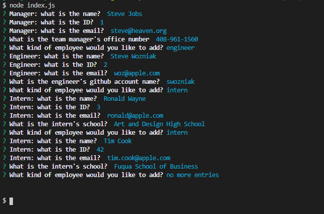
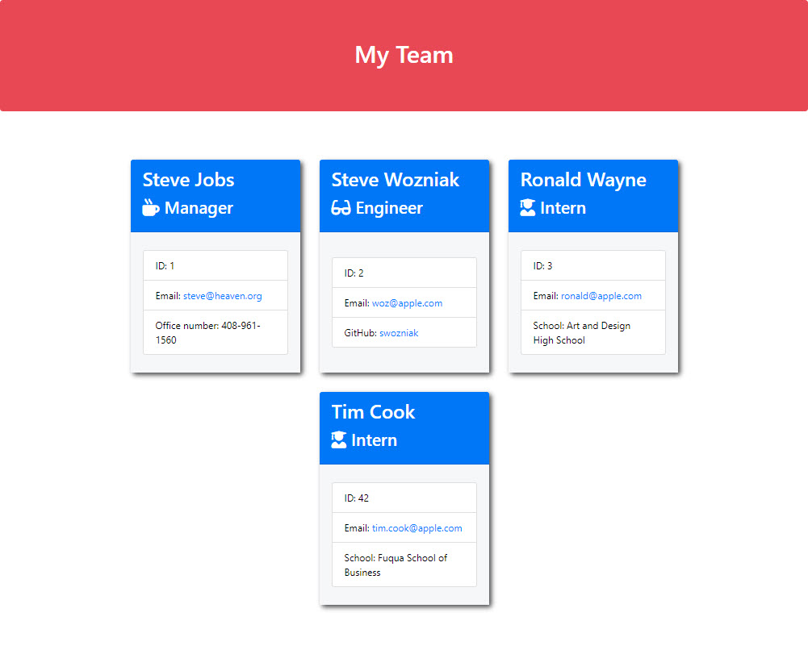

# 10-OOP-Team-Profile-Generator
Due Date: 4/3/2021 @ 11:59 PM
Coding Bootcamp assignment #10 - Node.js 

# Objectives
The primary objectives of this exercise were to demonstration the following:

* continued use of node.js
* deep use of inquirer
* use of jest for automated npm testing
* fs
* github report management with packages

# References / Resources 

|Description|Link|
|-----------|----|
|The different between shallow copy and deep copy|https://www.javascripttutorial.net/object/3-ways-to-copy-objects-in-javascript/|

# Test Results
```
$ npm test Employee

> jest "Employee"

 PASS  __tests__/Employee.test.js
  √ Can instantiate Employee instance (2 ms)
  √ Can set name via constructor arguments
  √ Can set id via constructor argument
  √ Can set email via constructor argument
  √ Can get name via getName()
  √ Can get id via getId()
  √ Can get email via getEmail()
  √ getRole() should return "Employee"

Test Suites: 1 passed, 1 total
Tests:       8 passed, 8 total
Snapshots:   0 total
Time:        1.252 s
Ran all test suites matching /Employee/i.
```

```
$ npm test Engineer

> jest "Engineer"

 PASS  __tests__/Engineer.test.js
  √ Can set GitHUb account via constructor (1 ms)
  √ getRole() should return "Engineer" (4 ms)
  √ Can get GitHub username via getGithub()

Test Suites: 1 passed, 1 total
Tests:       3 passed, 3 total
Snapshots:   0 total
Time:        1.272 s
Ran all test suites matching /Engineer/i.
```

```
$ npm test Intern

> jest "Intern"

 PASS  __tests__/Intern.test.js
  √ Can set school via constructor (2 ms)
  √ getRole() should return "Intern"
  √ Can get school via getSchool() (3 ms)

Test Suites: 1 passed, 1 total
Tests:       3 passed, 3 total
Snapshots:   0 total
Time:        1.259 s
Ran all test suites matching /Intern/i.
```
```
$ npm test Manager

> jest "Manager"

 PASS  __tests__/Manager.test.js
  √ Can set office number via constructor argument (2 ms)
  √ getRole() should return "Manager"
  √ Can get office number via getOffice()

Test Suites: 1 passed, 1 total
Tests:       3 passed, 3 total
Snapshots:   0 total
Time:        1.268 s
Ran all test suites matching /Manager/i.
```

# Screenshots





# Links
* This repo is located [on github](https://github.com/jonesjsc/10-OOP-Team-Profile-Generator)
* Sample output is available [on github](https://github.com/jonesjsc/10-OOP-Team-Profile-Generator/blob/main/output/myteam.html)
* A video of the test procedures [is available](https://drive.google.com/file/d/1-_O2-D3EaKX7jyKKMWbEREhNP_wb_v66/view)
* A video of the running program [is available](https://drive.google.com/file/d/1ExjIxHWsbgS-EDM_ahtgdn_4RFwlHkWi/view)